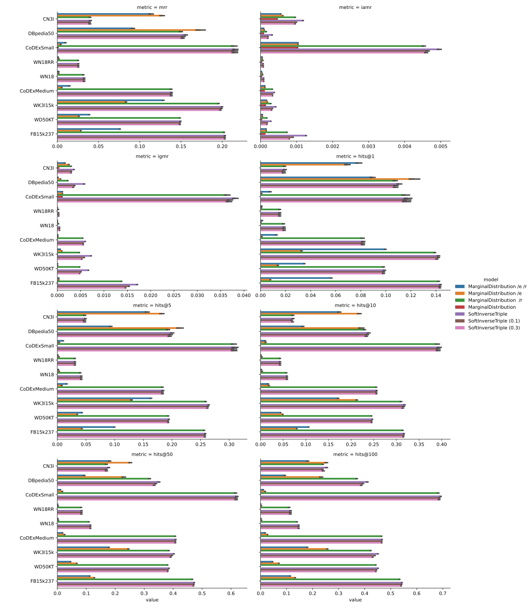
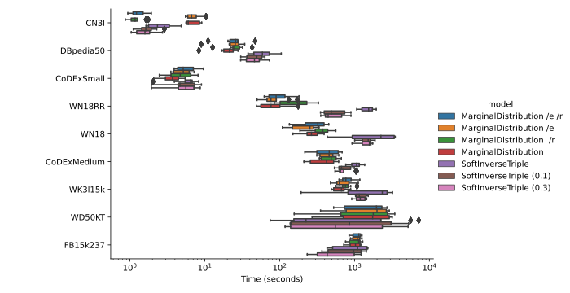

# Non-parametric Baseline Model Benchmark

This repo benchmarks the performance of non-parametric baseline KGE models, which make scores based on various
frequencies instead of training an interaction model.

These tests run pretty quickly compared to normal training, as there's no gradient tracking or anything like that:

